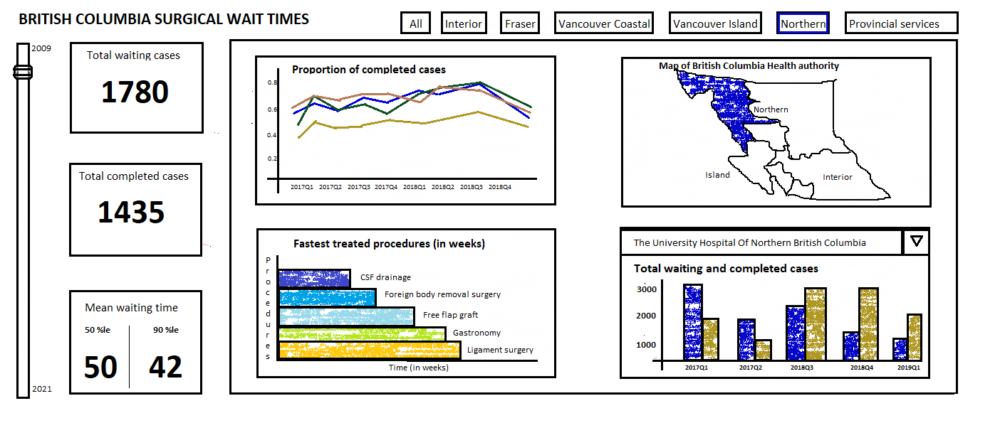

# BC Surgical Wait Times Dashboard (Group D)

### Welcome!

Hello folks!  Welcome to visit our BC Surgical Wait Times Dashboard app project repository!👏👏👏

This document (the README file) is going to give you an overview of our project. You can go straight to the part you are interested in, or just scroll down to find out more.

* [Who are we?](#who-are-we)
* [What is our dashboard for?](#what-is-our-dashboard-for)
* [What is our dataset?](#what-is-our-dataset)
* [What our dashboard is going to tell?](#what-our-dashboard-is-going-to-tell)
* [How do you use it?](#how-do-you--use-it)
* [How can you get involved?](#get-involved)
* [How to contact us?](#how-to-contact-us)

### Who are we?

- Jagdeep Brar: A data science student who loves cooking and painting in free time! 
- Saisree GR: An ethusiastic student and researcher who loves data science, hot chocolate and reading books 🤓
- Song Zhang: An analytical, dependable, and responsible person.
- Roger Wheeler: A Chartered Professional in Human Resources (CPHR) with a strong interest in analytics.

Links to deploy our app: (links to be added)
    
Jagdeep - [BC Surgical Wait Times Dashboard](https://BC Surgical Wait Times Dashboard.herokuapp.com/)    
    
Saisree - [BC Surgical Wait Times Dashboard](https://BC Surgical Wait Times Dashboard.herokuapp.com/)
   
Song -  [BC Surgical Wait Times Dashboard](https://BC Surgical Wait Times Dashboard.herokuapp.com/)
     
Roger - [BC Surgical Wait Times Dashboard](https://BC Surgical Wait Times Dashboard.herokuapp.com/)

### What is our dashboard for?

Long waiting times is an important issue for health services in Canada, and the main concern is about waiting times for elective treatments [[1]("https://www.oecd-ilibrary.org/social-issues-migration-health/waiting-times-for-health-services_242e3c8c-en")]. Among the OECD countries, Canada’s waiting times problem ranks in the medium-high priority level, while Germany, Korea, Japan, Switzerland, and U.S rank in low priority level [[2]("https://www.oecd-ilibrary.org/sites/242e3c8c-en/1/3/1/index.html?itemId=/content/publication/242e3c8c-en&_csp_=e90031be7ce6b03025f09a0c506286b0&itemIGO=oecd&itemContentType=book#chapter-d1e287")]. After the COVID-19 outbreak, tens of thousands of scheduled surgeries being cancelled or postponed across Canada, which prolonged the surgical wait times. In B.C. province, between Mar. 16 and May 18, 2020, it was estimated that 30298 elective nonurgent surgeries were either postponed or not scheduled because of the COVID-19 pandemic [[3]("https://www2.gov.bc.ca/assets/gov/health/conducting-health-research/surgical-renewal-plan.pdf")]. If we could have a public dashboard of surgical data like that of COVID-19 for the province, it will help both the patients to know the situation and the doctors as well as the health authorities to look at where improvements are most needed [[4]("https://bc.ctvnews.ca/b-c-doctors-criticize-top-down-approach-and-government-secrecy-as-minister-defends-surgical-strategy-1.5767547")]. Our app will show these key information in a visualization way!

### What is our dataset?

Our dataset comes from [BC Data Catalogue--BC Surgical Wait Times](https://catalogue.data.gov.bc.ca/dataset/bc-surgical-wait-times/resource/f294562c-a6fd-4d7f-8f99-c51c91891c67).

This dataset provides information of elective surgical procedures' wait times in British Columbia, containing the information of patients of all ages and only the scheduled surgical cases not the unscheduled ones. The data is collected quarterly at the end of each quarter from year 2009 to 2022Q1 with the following 9 variables:

1. **Quarter** : The quarter for which data is collected.
2. **Year** : The year for which data is collected.
3. **Waiting** : The number of surgical cases waiting at the end each quarter 
4. **Completed**: The number of surgical cases completed within each quarter.
5. **Health authority**: The health authority of the hospital from where data is collected.
6. **Hospital name**: The name of the hospital where the surgical procedures are performed.
7. **Procedure group**: The name of the surgical procedure type and data has 83 unique procedures.
8. **Completed 50th percentile**: For completed procedures, the number of weeks 50th percentile of the patients waited for surgery.
9. **Completed 90th percentile**: For completed procedures, the number of weeks 90th percentile of the patients waited for surgery.

### What our dashboard is going to tell?

On the BC Surgical Wait Times Dashboard, you can select the specific time period and the specific BC health authority, to find the key information below across the health authority during the time period:

- The total waiting and completed surgical cases and the mean waiting time 

- The surgical efficiency and the quarter effect

- The wait times of different procedures

- The total waiting and completed surgical cases in different hospitals

You can also observe the impact of pandemic on the surgical efficiency of health authorities and procedures.

### How do you use it?

The app opens a dashboard that shows the information about surgical waiting times in the province of British Columbia, Canada. Users can select health authorities of BC from the buttons (eg, Northern, Interior, Vancouver Island, Vancouver Coastal etc.) and years from the slider which will update the 4 charts (proportion of completed cases, BC health authority map, Fastest/Slowest treated procedures, total waiting and completed cases of a hospital) and information cards accordingly. The proportion of completed cases chart shows quarterly distribution of completed cases of all health authorities based on the selected years. The BC health authority map highlights the geography of the selected health authority. The fastest/slowest treated procedures chart has the option to select between fastest and slowest radio buttons. The total waiting and completed cases of a hospital has a dropdown menu of different hospitals based on the selected health authority.

(dashboard GIF can be added here)

### How can you get involved?

If you are interested in helping in any of the areas listed above or in any of the many areas that we haven't yet thought of, here we warmly welcome you join in. Please check out our [contributors' guidelines](CONTRIBUTING.md).

Please note that it's very important to us that we maintain a positive and supportive environment for everyone who wants to participate. When you join us we ask that you follow our [code of conduct](CODE_OF_CONDUCT.md) in all interactions both on and offline.

### How to contact us?

If you want to report a problem or suggest an enhancement we'd love for you to [open up an issue](https://github.com/ubco-mds-2021-labs/dashboard1-group-d/issues) at this github repository because then we can get right on it. But you can also contact by [email](sngchng@gmail.com).

### Thank you

Thank you so much for visiting the project and we do hope that you'll join us on this critical exploration to transparent the BC surgical situation.

